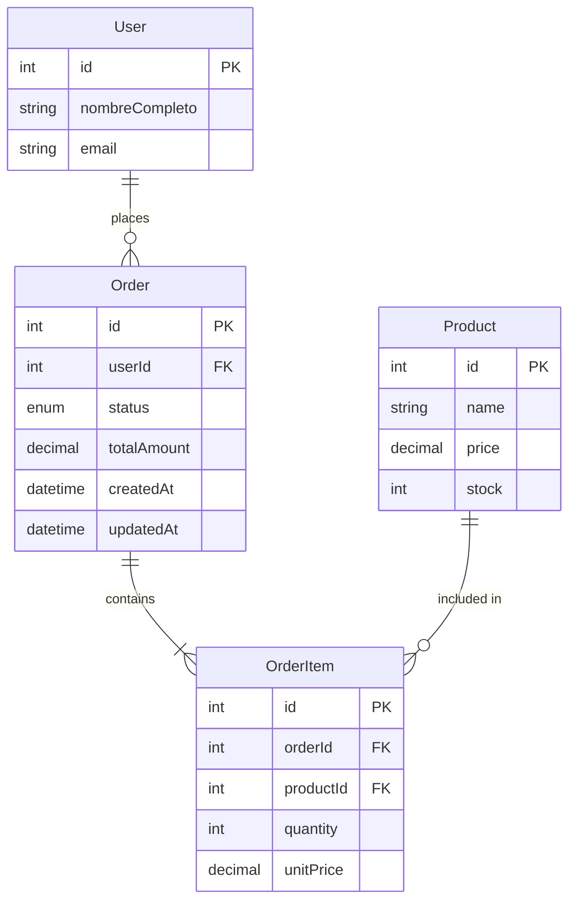

# Design Document: Transactional Core - Data Models

## Overview

Este diseño define la implementación de los modelos Order y OrderItem usando Sequelize ORM con TypeScript, siguiendo los patrones establecidos en el proyecto existente (Task 2). Los modelos establecerán las relaciones necesarias para gestionar órdenes de compra con múltiples productos.

## Architecture



## Components and Interfaces

### Order Model

```typescript
// src/models/Order.model.ts
interface OrderAttributes {
  id: number;
  userId: number;
  status: OrderStatus;
  totalAmount: number;
  createdAt: Date;
  updatedAt: Date;
}

enum OrderStatus {
  PENDING = 'PENDING',
  COMPLETED = 'COMPLETED',
  CANCELED = 'CANCELED',
  PAYMENT_FAILED = 'PAYMENT_FAILED'
}
```

### OrderItem Model

```typescript
// src/models/OrderItem.model.ts
interface OrderItemAttributes {
  id: number;
  orderId: number;
  productId: number;
  quantity: number;
  unitPrice: number;
}
```

## Data Models

### Order Model Implementation

- Table name: `Orders`
- Primary key: `id` (auto-increment)
- Foreign key: `userId` references `Users.id`
- Status: ENUM con valores PENDING, COMPLETED, CANCELED, PAYMENT_FAILED
- totalAmount: DECIMAL(10,2) - calculado como suma de (quantity × unitPrice) de OrderItems
- Timestamps: createdAt, updatedAt (automáticos de Sequelize)

### OrderItem Model Implementation

- Table name: `OrderItems`
- Primary key: `id` (auto-increment)
- Foreign keys: 
  - `orderId` references `Orders.id`
  - `productId` references `Products.id`
- quantity: INTEGER, debe ser > 0
- unitPrice: DECIMAL(10,2) - precio del producto al momento de la compra

### Relationships

1. **User → Order**: One-to-Many (Un usuario puede tener muchas órdenes)
2. **Order → OrderItem**: One-to-Many (Una orden tiene muchos items)
3. **Product → OrderItem**: One-to-Many (Un producto puede estar en muchos items)
4. **Order ↔ Product**: Many-to-Many (a través de OrderItem)

## Correctness Properties

*A property is a characteristic or behavior that should hold true across all valid executions of a system-essentially, a formal statement about what the system should do.*

### Property 1: Order Status Validity
*For any* Order instance, the status field SHALL only contain one of the valid enum values: PENDING, COMPLETED, CANCELED, or PAYMENT_FAILED.
**Validates: Requirements 1.4**

### Property 2: OrderItem Quantity Positivity
*For any* OrderItem instance, the quantity field SHALL be greater than zero.
**Validates: Requirements 2.4**

### Property 3: Order Total Calculation
*For any* Order with OrderItems, the totalAmount SHALL equal the sum of (quantity × unitPrice) for all associated OrderItems.
**Validates: Requirements 1.5**

### Property 4: Historical Price Preservation
*For any* OrderItem, the unitPrice SHALL remain unchanged after creation, regardless of subsequent Product price changes.
**Validates: Requirements 2.5, 2.6**

## Error Handling

1. **Foreign Key Violations**: Si se intenta crear un Order con userId inexistente o OrderItem con orderId/productId inexistente, Sequelize lanzará error de constraint
2. **Invalid Status**: El ENUM de Sequelize rechazará valores de status inválidos
3. **Negative Quantity**: Validación a nivel de modelo para rechazar quantity <= 0

## Testing Strategy

### Unit Tests
- Verificar creación de Order con campos válidos
- Verificar creación de OrderItem con campos válidos
- Verificar relaciones entre modelos
- Verificar cálculo automático de totalAmount
- Verificar validaciones de campos

### Property-Based Tests
- Generar órdenes aleatorias y verificar que totalAmount siempre sea correcto
- Generar OrderItems y verificar que unitPrice se preserve
